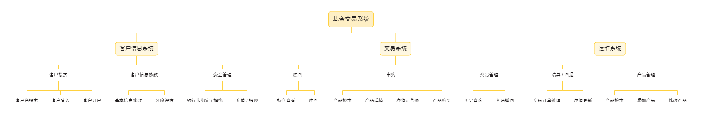

# 基于 Vue 的面向机构的基金交易系统

面对日益庞大的基金交易网络，交易机构对基金交易的管理需求逐渐凸显。
本系统为交易机构提供了一个基金交易平台。

平台功能：

- 用户信息增删改查，模拟银行卡进行钱包交易
- 基金申购赎回交易操作
- 交易历史订单记录查询、交易撤销
- 基金信息增删改查，利用Echarts简易绘制净值曲线
- 系统每日交易清算、回退运维管理

> 团队项目
技术栈：前端基于 Vue.js ，后端基于 Java 框架 JRES 与 MySQL8

功能模块设计：


## Build Setup

``` bash
# install dependencies
npm install

# serve with hot reload at localhost:8080
npm run dev

# build for production with minification
npm run build

```

For a detailed explanation on how things work, check out the [guide](http://vuejs-templates.github.io/webpack/) and [docs for vue-loader](http://vuejs.github.io/vue-loader).
